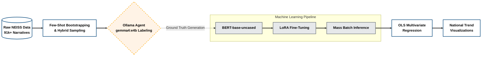

# NEISS Vitamin & Supplement ED Visit Analysis

## Project Overview
Vitamins, herbs, and dietary supplements are widely marketed as harmless and possibly helpful. This project investigates the **National Electronic Injury Surveillance System (NEISS)** database over the past 21 years to determine national temporal trends in emergency department (ED) visits related to poisoning or adverse reactions associated with these substances (e.g., ashwagandha, turmeric, vitamin B12, melatonin). 

### The Data (NEISS)
The National Electronic Injury Surveillance System (NEISS) is a U.S. system managed by the Consumer Product Safety Commission (CPSC). It collects data on consumer product-related injuries treated in hospital emergency departments. 

**National Estimates & Statistical Weighting:**
By utilizing a probability sample of approximately 100 U.S. hospitals, the NEISS allows researchers to extrapolate and create highly accurate national estimates. Each case in the dataset is assigned a **statistical weight**; the sum of these weights represents the total estimated number of ED visits nationwide. This project leverages these weights to ensure all temporal and demographic trends reflect the entire U.S. population.

### Project Goals
* **Automated Classification:** Scalable processing of >90,000 medical narratives.
* **Epidemiological Modeling:** Identifying statistically significant shifts in exposure patterns.
* **Public Health Impact:** Distinguishing between safe vitamin use and high-risk supplement exposures (e.g., iron toxicity or non-vitamin botanicals).

---

## System Architecture

The repository utilizes a **Teacher-Student Machine Learning Pipeline** to achieve high-precision classification at scale, followed by a rigorous statistical evaluation.



---

## Repository Architecture & Workflow

### 1. Zero-Shot / Few-Shot Data Labeling (The Teacher)
* **Script:** `scripts/1_prepare_data.py`
* **Model:** `gemma4:e4b` (via Ollama)
* **Function:** Instead of manually labeling thousands of medical narratives, we use a local Large Language Model as a "Silver Standard" labeler. Utilizing a strict Chain-of-Thought (CoT) prompt and JSON structured output, the model evaluates a sample of narratives to identify true supplement exposures.
* **Filtering:** The model is instructed to rigorously filter out exceptions such as iron toxicity, pharmaceuticals, and household chemicals, creating a high-quality "Ground Truth" training dataset.

### 2. Fine-Tuning & Mass Inference (The Student)
* **Script:** `scripts/2_train_bert.py`
* **Model:** `bert-base-uncased` + LoRA
* **Function:** A BERT sequence classifier is fine-tuned on the LLM-generated dataset using **Low-Rank Adaptation (LoRA)**. 
* **Scalability:** Once the student model (BERT) reaches convergence, it performs high-speed inference across the entire 21-year database. This approach achieves a **200x speedup** compared to processing the whole dataset via LLM while maintaining deep semantic understanding.

### 3. Statistical & Temporal Analysis
* **Notebook:** `temporal_analysis.ipynb`
* **Modeling:** Ordinary Least Squares (OLS) Linear Regression with **Heteroscedasticity and Autocorrelation Consistent (HAC)** standard errors.
* **Interaction Terms:** We model the interaction between `Year` and `Category` to detect if specific demographics (e.g., pediatric age groups) are diverging from the national baseline.
* **Seasonality:** Analysis of normalized monthly shares to identify cyclic patterns in vitamin-related hospitalizations.

---

## Setup & Requirements

1. **Ollama:** Ensure [Ollama](https://ollama.com/) is installed and the model is available:
   ```bash
   ollama pull gemma4:e4b
   ```
2. **Python Environment:**
   ```bash
   pip install -r requirements.txt
   ```
3. **Execution:**
   * Run `scripts/1_prepare_data.py` to generate the training set.
   * Run `scripts/2_train_bert.py` to train the classifier and process the full database.
   * Use `temporal_analysis.ipynb` for final reporting.